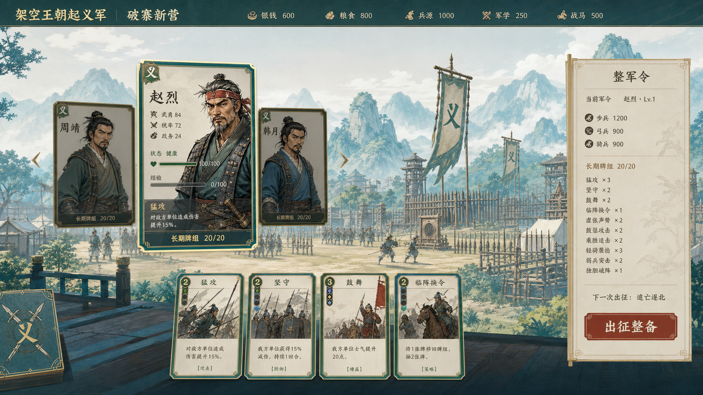

# 《架空王朝起义军》美术视觉风格规范：青绿绘卷卡阵 V0.1

- 状态：**Vertical Slice 视觉方向已锁定**
- 确认日期：2026-09-02
- 适用平台：macOS / Windows 横屏桌面端，键鼠优先
- 设计基准：1600×900；最低验收分辨率：1280×720

## 1. 文档权威与使用方式

本文件是 Vertical Slice 的美术风格权威，约束主城、军议堂、出征整备、远征地图、战斗、结算、失败/Game Over、卡牌、人物、敌军、图标、动效和视觉特效。

- 标记为【锁定】的规则，新增资产和 UI 不得自行偏离。
- 标记为【原型暂定】的规格必须集中配置或形成可替换资源，不得散落硬编码。
- 标记为【待设计】的内容只保留边界，不提前制作或推导玩法。
- 本文件只锁美术表达，不改变 Combat、Expedition、Campaign、卡组或存档规则。
- 与玩法数据冲突时，以玩法设计与运行时数据为准；美术稿中的数字、卡名和布局示意不得反向成为规则。

## 2. 核心方向【锁定】

风格名称：**青绿绘卷卡阵**。

一句话定义：

> 以清雅明亮的青绿山水绘卷承载“草莽起兵到军势成形”的世界，以清晰、精致、可收集的武将牌与行动牌承载核心策略。

三个视觉支柱：

1. **青绿绘卷**：山川、城寨和战场采用当代化的青绿山水、淡墨和轻设色表达，画面有空气与层次，不走焦黑写实。
2. **卡牌优先**：武将、战术、路线和结算信息首先通过统一卡牌语法组织，让玩家一眼识别为策略卡牌游戏。
3. **义军成长**：初期质朴但不肮脏；成长通过营寨秩序、旗帜、人数、建筑和色彩饱和度增强表达，而不是简单增加金饰和宫廷装潢。

## 3. 视觉基准图【锁定方向】

- 项目文件：`assets/art_direction/visual_style_reference_qinglu_scroll_cards_v0.1.png`
- 原始尺寸：1672×941，使用时按 1600×900 的逻辑画布重排，不拉伸。
- SHA-256：`493c790076df643de1f3cd1e0fe57360f85b8e2f1084432b95778ad5ee3d30aa`
- 基准图锁定的是配色关系、清洁度、材质、卡牌占比、留白和整体气质，不锁定生成图中的具体人物脸、文字、数值或玩法。
- 基准图中的“20/20”等内容不构成卡组规则；军议堂和出征整备必须遵循 D-020 的公共基础牌与武将专属牌规则。

## 4. 情绪与叙事基调【锁定】

目标感受：**清醒、克制、坚韧、渐成气象**。

- 义军不是仙侠门派，也不是华丽帝国军；装备和建筑应质朴、实用、可修补。
- 质朴不等于脏乱。营寨允许木材、粗布和手工痕迹，但界面纸张、卡面、文字区必须干净。
- 战争压力通过兵力、士气、伤势、天气和构图表达，不使用全屏污渍、重颗粒和长期昏暗滤镜。
- 胜利后的爽感来自画面变开阔、营寨更有秩序、旗帜更完整、人群更自信；不靠突然变成皇家金碧辉煌。

### 禁止方向【锁定】

- 大面积棕黑、焦土、油污、泥浆、破纸、血渍或烟尘覆盖。
- 写实苦难摄影感、末日废土感、恐怖压迫感。
- 仙侠发光、法术粒子、龙纹滥用、神兽、漂浮兵器。
- 宫廷奢华、金色堆叠、雕龙画凤、过度精致的皇家甲胄。
- Q 版、二次元萌系、夸张网游时装。
- 现代 SaaS 卡片矩阵、玻璃拟态、霓虹赛博、无历史语境的通用图标。

## 5. 色彩系统【锁定】

| Token | 色值 | 用途 | 限制 |
|---|---:|---|---|
| `ink_teal_900` | `#103B42` | 顶栏、牌背、深色底、主要轮廓 | 不作为大段正文底上的细字色 |
| `ink_charcoal_900` | `#202722` | 纸面正文、线稿、禁用态轮廓 | 主正文首选 |
| `mineral_teal_600` | `#4E7F78` | 兵种/势力辅助色、选中态 | 浅字置于其上只限大字；正文需改用深墨色 |
| `mountain_blue_400` | `#7EAFB7` | 山水远景、雾层、冷色反馈 | 不单独表达可操作状态 |
| `mist_100` | `#DCEBE9` | 淡色背景、悬停底色 | 必须保留深色正文 |
| `paper_ivory_100` | `#F3EAD6` | 卡面、军报、正文承载面 | 禁止叠加大面积污渍 |
| `bronze_gold_500` | `#C9A95C` | 牌框、标题、品质和焦点轮廓 | 面积保持克制，不铺满背景 |
| `cinnabar_600` | `#A74331` | 主行动、危险、不可逆确认 | 同一屏只允许一个主朱砂行动 |
| `success_jade_600` | `#4E7658` | 健康、完成、恢复 | 必须配合图标/文字，不只靠颜色 |
| `danger_red_600` | `#B64F3C` | 伤势、死亡、失败 | 不替代明确后果文本 |

已验证的基础文本组合：

- `ink_charcoal_900` / `paper_ivory_100`：对比度约 12.77:1。
- `paper_ivory_100` / `ink_teal_900`：对比度约 10.17:1。
- 浅色字 / `cinnabar_600`：对比度约 5.51:1。
- `bronze_gold_500` / `ink_teal_900`：对比度约 5.39:1。

颜色不能单独承担兵种、稀有度、伤势、节点状态或可用性；必须同时使用图标、边框纹样、形状或文字。

## 6. 字体与文字层级【锁定方向】

- 标题/章名：思源宋体 CN，建议 SemiBold / Bold；少量题签可用更有书写感的字形，但不得进入正文。
- 正文/数值/UI：思源黑体 CN，建议 Regular / Medium / Bold。
- 全项目最多两套主字体家族；正式导入前完成字体文件、字重、简繁字符覆盖和授权归档。
- 正文逻辑字号不低于 16 px；1280×720 下关键正文不低于 15 px。
- 数值使用等宽数字特性或固定宽度栏位，避免资源和战斗数值跳动。
- 长段说明控制在每行约 22～32 个汉字；卡牌效果优先拆分关键词和数值。

【原型暂定】标题、正文、辅助文字的逻辑字号阶梯为 36 / 24 / 18 / 16 / 14；首次真机替换后根据中文可读性复核。

## 7. 材质与线条【锁定】

### 允许

- 完整、干净的素纸与绢本；纤维纹理只在近看时可见。
- 青绿矿物色、淡墨线稿、轻微套色偏差和手绘边缘。
- 细淡金或氧化铜线框；结构转角可借鉴竹简、铜件和旗帜绑带。
- 背景可有天气、雾和炊烟，但不得压低交互区对比度。

### 禁止

- 正文背后的污点、折痕、破洞、烧焦边和高频噪点。
- 每个面板都做厚重卷轴、木牌或金属框。
- 以大面积投影、发光描边和高亮粒子制造“高级感”。
- 同屏混用写实照片、厚涂人物、木刻图标和扁平矢量卡面。

## 8. 卡牌视觉系统【锁定】

卡牌是全项目最重要的交互语言，不只存在于战斗手牌。

### 8.1 比例与层级

- 标准比例统一为 2:3。
- 武将牌、行动牌、路线/事件牌共用圆角、边线粗细、牌背和选中反馈，内部信息区可以不同。
- 画面中同时出现多张牌时，必须先建立主牌、次牌和背景牌层级，不允许全部等大等亮。
- 悬停以轻微上浮、放大和淡金轮廓表达；不可用牌降低明度，同时保留标题和不可用原因。

【原型暂定】1600×900 下：战斗手牌约 168×252，武将主牌约 260×390，牌组预览约 96×144；1280×720 下允许等比缩小或进入横向滚动，不压缩正文。

### 8.2 行动牌构成

1. 左上：行动力费用，位置固定。
2. 顶部：卡名与兵种/战术类别。
3. 中部：单一叙事焦点插画，避免塞满多名无关人物。
4. 下部：效果正文；预计实际伤害优先突出。
5. 底部：条件、关键词、升级分支或耗尽标记。
6. 外框：只表达稳定分类，不把强度完全绑定颜色。

### 8.3 武将牌构成

- 半身或大半身肖像，脸部、武器/姿态和服装轮廓可在小尺寸识别。
- 固定显示姓名、等级、健康/伤势、核心属性、天赋标记和专属牌数量。
- 三名武将必须拥有不同的轮廓语言：赵烈偏前压与进攻，周靖偏稳固与防守，韩月偏机动与远程。
- 死亡、重伤、不可出征不得只做灰色滤镜；需配合明确印记、状态文字和交互禁用。

### 8.4 牌背与图形母题

- 公共牌背：交叉义军旗与山形纹。
- 武将专属牌：在公共牌背上增加个人印记，不另建完全无关系统。
- 军令/节点：使用方印、旗签和地图折线作为辅助母题。
- 稀有度【原型暂定】使用角标数量和边框纹样密度，不只使用颜色。

## 9. 人物与敌军美术【锁定方向】

- 时代感采用“架空古代中国”而非指定真实朝代复刻；服装、甲胄和器械应内部一致。
- 人物采用干净的半写实设色线稿：清晰轮廓、适度写实五官、克制材质，不做照片级皮肤和满脸污泥。
- 义军必须一眼呈现为山寨起事队伍：以粗布短褐、补丁裤、绳带、绑腿、旧布标记和缴获/自制武器为主，不穿完整制式札甲、成套胸甲、对称肩甲或统一头盔；最多保留单侧、错配的小块皮护肩/护腕。官军可使用规整甲胄与统一装备，但不能靠金光与奢华区分。
- 武将辨识优先级：轮廓 > 姿态/武器 > 头部特征 > 局部颜色。
- 同一角色的武将牌、战斗头像、结算插图必须来自统一设定稿。
- 生成概念图中的现有人脸不是角色定案；3 名武将与严成需另做正面/侧面/装备/表情设定并评审。

### 9.1 战场人物模板【原型暂定】

- 战斗中的敌我人物使用透明背景的全身战场立绘，不再使用带矩形底板的半身头像；人物脚部必须落在同一地平线，并保留轻微接地阴影。
- 借鉴卡牌战斗游戏的空间信息层级，但不复制其人物造型：角色是战场主视觉，兵力与士气紧贴人物下方，Intent 独立常驻，手牌保持底部最高交互优先级。
- 战场人物采用简化的 2.5D 卡通塑形：圆润体块、大面积纯净色块、柔和定向明暗和少量甲片分区；禁止密集札甲、布料微纹理、细碎绑带与写实皮肤细节。该简化仅用于战场小尺寸模板，不反向要求卡牌插画照搬同一建模感。
- 参考图只锁定“低细节、强体块、易识别”的视觉语法，不复制特定历史人物、长须、冠帽、龙纹、金甲或其他可识别角色设计。
- Vertical Slice 先建立少量可复用兵种模板：步兵、弓兵、骑兵、重甲/Boss。普通敌军允许复用同兵种模板，通过朝向、阵营色、武器附件、头盔/旗号和尺寸变体区分；关键武将与 Boss 仍需独立设定。
- 模板资产必须交付真实 RGBA 透明通道、完整头顶/武器/脚部、统一 3/4 侧身备战姿态；禁止把棋盘格、白底或场景背景烘进图片。
- 当前代表性模板组已登记六个稳定表现 ID：义军步兵、义军弓兵、义军骑兵、官军步兵、官军弓兵和官军重甲；人物显示槽位统一为 214×176，比早期 V0.1 缩小约 15%。周靖/韩月/赵烈按主兵种选择无制式甲胄的义军模板，普通官军按主兵种选择规整模板，贺巍与严成使用官军重甲。关键武将与 Boss 的最终人物设定仍须独立评审。

## 10. 场景与界面映射【锁定方向】

### 10.1 起始页

- 使用大幅青绿远山与初期山寨远景，标题和“建立新军/继续战役”保持简洁。
- 不提前展示王都、完整世界地图或未实现势力。

### 10.2 主城与军议堂

- 主城是可成长的横向绘卷，功能入口嵌入地景或旗签。
- `ruined_camp` 与 `rebel_camp` 至少在旗帜完整度、建筑秩序、人员密度和远景开阔度上有清晰差异。
- 军议堂以卡阵为视觉主语：公共基础牌为主要编辑对象，武将专属牌只在出征整备显示合成结果。
- 中后期“都督府/军府、王都”继续【待设计】，本阶段只锁继承青绿绘卷与卡牌语法，不制作正式画面。

### 10.3 出征整备

- 以一张主武将牌带动兵种与卡组信息；其他武将作为次级候选牌。
- 三兵种配置使用稳定图标与比例条，不绘制成独立场上单位。
- 主要行动始终是朱砂“确认军令/开始远征”。

### 10.4 河源县行军图

- 采用横向绘卷地图和旗签/方印节点；路径为墨线或淡金军报线。
- 已完成、可选、未知、不可达状态必须同时有形状、纹样、文字/图标差异。
- 不做即时大地图，不绘制可自由移动军团。

### 10.5 战斗

- “武将/兵种模板 VS 武将/兵种模板”保持为视觉核心，双方使用全身透明立绘，不放入矩形肖像面板。
- 人物下方只常驻名称、兵力条和士气条；护甲、攻击、防御、兵种构成等次级数值在鼠标悬停或键盘聚焦人物时展开，不能只支持鼠标。
- 敌方 Intent 属于回合决策所需公开信息，必须常驻且不得藏入悬停详情。
- 手牌是底部最强交互区；场景为青绿淡墨战阵背景，不抢夺文字可读性。
- 兵种通过人物模板、构成文字/图标和卡牌条件表现；人物模板是表现层立绘，不增加可直接操控的步/弓/骑单位。

### 10.6 结算、失败与 Game Over

- 成功：展开的军报、完成印、画面增亮和营寨成长反馈。
- 撤退/失败：冷色退墨、断印或空白区域表达损失；仍保持正文清晰，不以全屏血污替代信息。
- 永久死亡：角色印记封存、肖像退色和明确文字；避免恐怖化特写。
- 结果页只表现已有 Combat/Expedition/Campaign 结论，不新增规则判断。

## 11. 图标、状态与反馈【锁定方向】

- 图标采用简化线刻/印章语言，轮廓粗细统一，优先从器物和军报符号提炼。
- 步兵、弓兵、骑兵、士气、兵力、护甲、行动力、银钱、粮食、兵源、军学、战马、精铁、伤势、死亡、未知节点必须有稳定图标。
- 16～24 px 小尺寸下仍能通过轮廓区分；不得依赖复杂插画细节。
- 主行动为实心朱砂；普通行动为素纸/深青轮廓；危险和不可逆操作在文字中明确说明。

## 12. 动效与特效【原型暂定】

- 页面切换：短淡入或绘卷展开，建议 180～260 ms。
- 卡牌悬停：上浮 8～12 px、放大 1.03～1.06，建议 100～160 ms。
- 抽牌/弃牌：沿牌堆与手牌之间的真实路径运动，保持 Seed/规则展示不受影响。
- 节点解锁：印章落下或墨线延展，不使用爆炸粒子。
- 受击：全身人物立绘轻震、兵力数值清晰变化；避免强烈屏闪。
- 士气变化：旗帜或墨色浓淡辅助表达，不能取代数值。
- 提供降低动态效果选项；关键反馈不能只存在于动画中。

## 13. 分辨率与可读性质量门【锁定】

- 设计画布为 1600×900，必须同时验证 1280×720。
- 两个分辨率都要走通：主城 → 军议堂/整备 → 地图 → 战斗 → 结算，以及撤退、失败、重伤、永久死亡和 Game Over。
- 任何背景插画都必须允许 UI 安全区重排；不得把唯一叙事焦点放在可能被裁切或被面板覆盖的位置。
- 卡牌正文、Intent、不可用原因、预计伤害和永久后果是最高可读性优先级。
- 焦点态、悬停态、按下态、禁用态、选中态均需独立验收。
- 避免强烈闪烁；文字和图标不能只靠颜色区分。

## 14. 资产制作与交付规范【锁定方向】

- 保留可编辑源文件、字体/笔刷/纹理来源和授权记录；导出物不得成为唯一源文件。
- 人物与卡牌插画分层保留角色、背景、前景特效，便于裁切和状态变体。
- UI 九宫格、图标和边框优先使用可缩放资源；不要把文字烘焙进图片。
- 透明资源导出 PNG；大幅无透明场景根据 Godot 实测选择 WebP/PNG，并检查压缩后的线稿和文字边缘。
- 文件名使用稳定英文 ID，并与内容定义 ID 建立清单映射。
- AI 生成图只能作为构图/风格参考或经过人工修绘、版权与一致性检查的中间稿，不能未经审查直接当作正式资产。

## 15. Vertical Slice 美术资产任务规划

任务顺序按“先锁系统、再做代表资产、再批量生产、最后整合验收”执行。

### A0 视觉系统与工具链（P0）

| 任务 | 交付物 | 验收 |
|---|---|---|
| ART-001 风格规范 | 本文档、基准图、变更流程 | 锁定项/原型项/待设计项分离 |
| ART-002 字体与授权 | 两套字体、字重、授权记录、Godot 导入测试 | macOS/Windows 中文无缺字 |
| ART-003 色彩与 UI Token | 色板、主题资源、状态色和对比度表 | 1600×900 / 1280×720 可读 |
| ART-004 卡牌模板 | 行动牌、武将牌、牌背、可用/禁用/升级状态 | 一套模板覆盖战斗与整备 |
| ART-005 图标母版 | 资源、战斗、兵种、节点、伤亡图标 | 16/24/32 px 轮廓可辨 |

### A1 代表性竖切（P0）

先制作最小代表集，不立即铺满 19 张卡和 8 名敌人：

- 赵烈、周靖、韩月 3 张武将主牌与状态变体。
- 6 张代表行动牌：攻击、防守、士气、弓弩、骑兵、条件/耗尽各覆盖至少一种。
- `ruined_camp` 主城全景、军议堂、出征整备、河源县地图、战斗、成功/失败结算各 1 个关键画面。
- 1 名普通敌人、1 名精英和严成 Boss 的代表肖像。

验收后才能进入批量资产生产；若卡面正文或两分辨率布局不成立，先修模板。

### A2 Vertical Slice 完整资产（P1）

- 19 张正式行动卡插画与卡面。
- 3 名武将完整头像/半身设定、健康/重伤/死亡状态。
- 8 类敌军/Boss 肖像与 Intent 所需图标。
- 河源县 15 节点所需的节点类别、三处军事据点、县城 Boss、补给/情报/战利品/事件视觉。
- `ruined_camp` 与 `rebel_camp` 两阶段主城差异资产。
- 起始页、整备、地图、战斗、结算、恢复、Game Over 所需 UI 皮肤与背景。

### A3 整合、动效与验收（P1）

- 卡牌悬停、抽弃牌、Intent、节点解锁、结算印章等动效。
- 全流程真实键鼠交互和两分辨率截图对照。
- 色觉、对比度、字体、焦点态、禁用态和降低动态效果检查。
- 资产压缩、显存、加载时间和跨平台导入复核。

### 不进入当前批次【待设计】

- 完整世界地图、即时军团移动、多城独立画面。
- 都督府/军府、王都的正式画面与完整成长动画。
- 招贤候选池、更多武将、复杂装备和 V0.5+ 事件量产。
- 宣传立绘、商店胶囊图、过场动画和完整品牌营销套件。

## 16. 风险台账

| 风险 | 影响 | 控制措施 |
|---|---|---|
| 画面再次变脏变暗 | 中文和卡牌信息难读，偏离选定方向 | 禁止全屏污渍；每次评审与基准图并排比较 |
| 卡牌化只停留在边框 | 看起来仍像管理面板 | A1 先验证武将牌、行动牌、牌背、费用和状态完整语法 |
| 人物与场景风格不一致 | 角色像贴在背景上 | 同一线稿粗细、设色范围、明暗和材质规范；统一设定稿 |
| 生成图文字/数值误导实现 | 美术稿反向改变玩法 | 所有数字和规则从运行时绑定；基准图仅作风格参考 |
| 青绿色被误用为低对比文字 | 可读性下降 | 正文固定深墨；颜色只作辅助，按对比度表验收 |
| 19 张卡与 8 敌人直接量产导致返工 | 模板问题被放大 | A1 代表集通过后才进入 A2 |
| 中后期主城被提前定型 | 超出 Vertical Slice 并锁死 V0.5 | 只制作 `ruined_camp`、`rebel_camp`；后续阶段保持待设计 |

## 17. 防止风格漂移的验收清单【锁定】

每个新界面或资产进入项目之前，必须逐项回答“是”；确实不适用的项目必须写明原因：

1. 是否仍能用“青绿绘卷卡阵”准确描述？
2. 是否以素纸、深青、矿物青绿、淡金和少量朱砂为主要关系？
3. 是否保持干净明亮，没有全屏污渍、重烟、泥浆或棕黑滤镜？
4. 卡牌是否遵循统一 2:3 比例、费用位置、牌框、牌背和状态反馈？
5. 人物是否历史可信、轮廓清晰、非仙侠、非宫廷奢华、非照片写实？
6. 画面是否让核心主行动和关键卡牌先被看到？
7. 是否同时通过 1600×900 与 1280×720 的真实交互检查？
8. 是否用图标/形状/文字补充颜色信息？
9. 是否只表现已有玩法规则，没有由美术稿新增或重算规则？
10. 是否与基准图并排复核过，而不是凭印象判断“差不多”？

任一答案为“否”，资产不得标记为完成；若确需改变锁定方向，先在 `docs/decisions/待确认决策.md` 新增决策并由用户确认，再更新本文档、模板和受影响资产。

## 18. A0-A1 实施状态（2026-09-02）

- 已实现集中 Theme/Token、思源宋黑字体、CardView、GeneralCardView、图标母版和降低动态效果策略。
- 军议堂、出征整备与战斗共用表现组件；卡牌费用、伤害和条件仍完全来自运行时输入，表现层未新增规则计算。
- `data/presentation/visual_assets.json` 以稳定 ID 绑定 19 张卡、3 名武将、8 类敌军、必需页面与图标；A2 未制作项使用显式 `a2_fallback`，不得冒充正式资产。
- 已制作 6 张代表卡、3 名武将、3 个敌军层级与 2 张核心场景中间稿，并完成 1600×900、1280×720 的 10 类状态捕获。
- 自动化仅证明资产可解析、接口边界与布局成立；ART-008 仍需真人判断费用/条件/可用性、武将差异和整体风格。
- 周靖手中简牍的生成伪字、回退卡面疑似印记等必须在人工修绘时移除；正式生产前还需 Windows 字体导入与授权签字。
